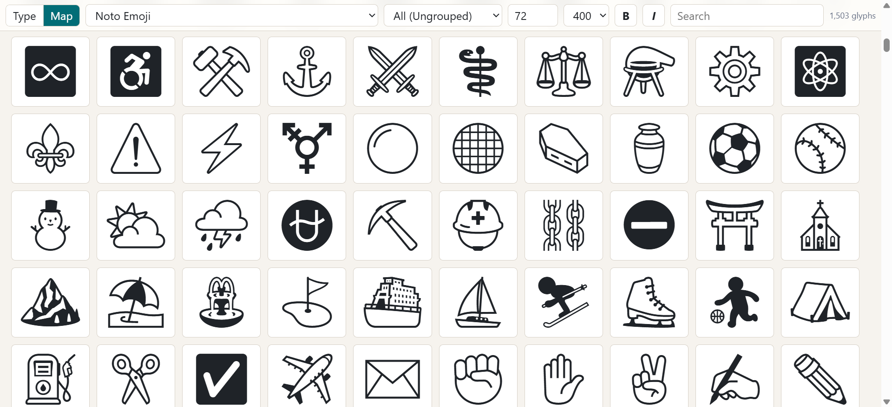

# Fontview


`fontview` is a small CLI for inspecting icon, dingbat, emoji, and display fonts.
It scans font files, finds defined Unicode glyphs, and opens a local web view for
typing samples or browsing a glyph map.



## Install

### With eget

```bash
eget dannyben/fontview
```

### From GitHub Releases

Download the archive for your operating system and CPU from the repository's
[Releases page](https://github.com/DannyBen/fontview/releases), extract it,
and put the `fontview` binary somewhere on your `PATH`.

### From Source

```bash
go install github.com/dannyben/fontview@latest
```

## Usage

Start a local server for all fonts under the current directory:

```bash
fontview
```

Inspect specific files or directories:

```bash
fontview SomeFont.ttf icons/ emoji/
```

Write a standalone HTML report instead of starting the server:

```bash
fontview --html
fontview --html -o fonts.html icons/
```

By default, the server listens on `0.0.0.0:3000`. Override it with:

```bash
fontview --addr 127.0.0.1:9000
```

## Interface

- `Type` view: full-window text area for trying the selected font.
- `Map` view: browsable glyph map grouped by broad Unicode categories.
- Font, category, size, weight, bold, italic, and search controls live in the
  fixed header.
- Clicking a glyph copies it to the clipboard.

## Supported Inputs

`fontview` discovers these extensions recursively:

- `.ttf`
- `.otf`
- `.woff`
- `.woff2`

Hidden directories such as `.git` are skipped.
